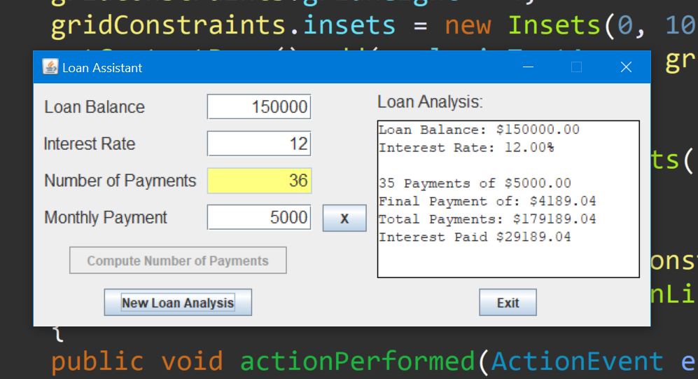
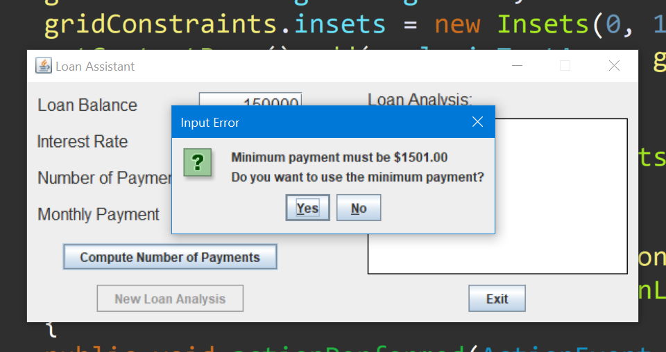
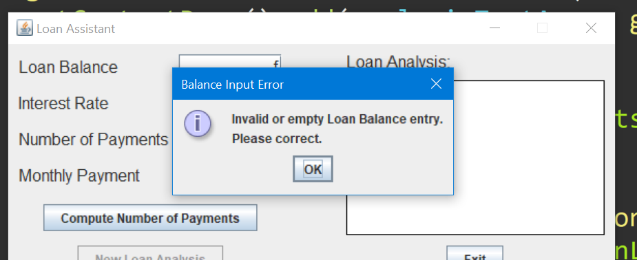

# Loan-Assistant

In this project, we will build a consumer loan assistant. You input a loan balance and yearly interest rate. You then have two options: 

(1) enter the desired number of payments and the loan assistant computes the monthly payment, or 

(2) enter the desired monthly payment and the loan assistant determines the number of payments you will make. 

An analysis of your loan, including total of payments and interest paid is also provided.

Demo images : 

